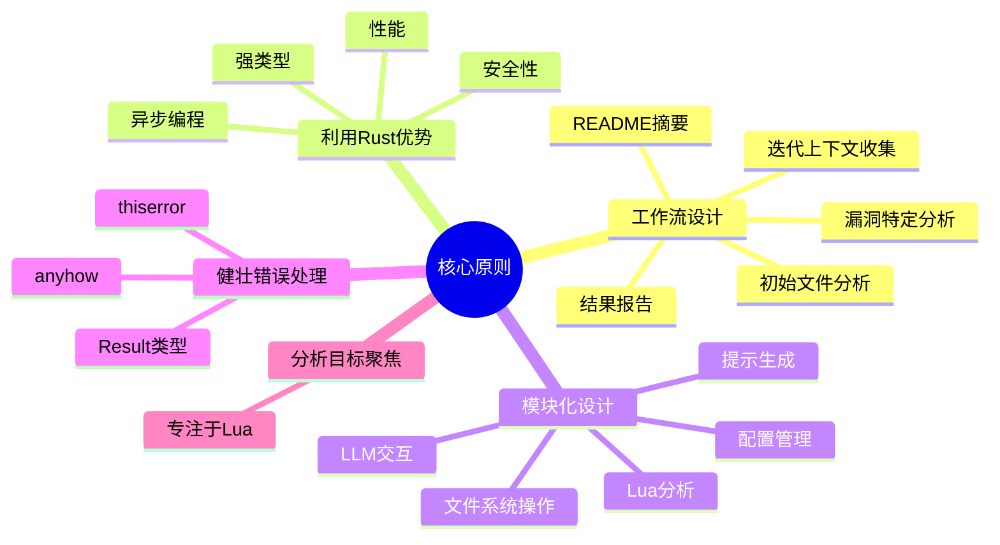
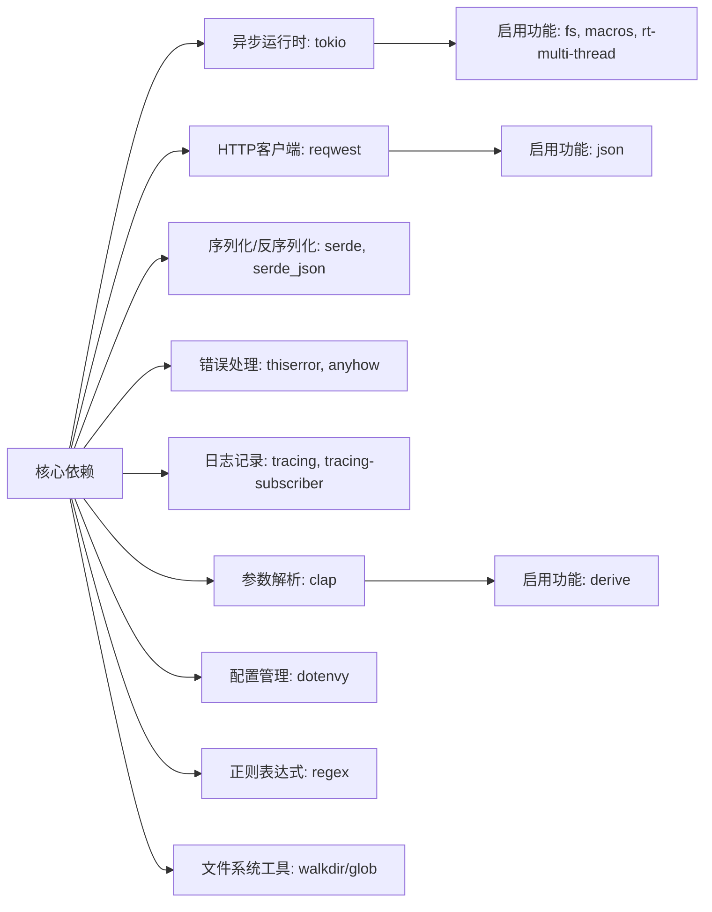
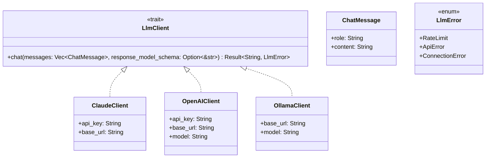
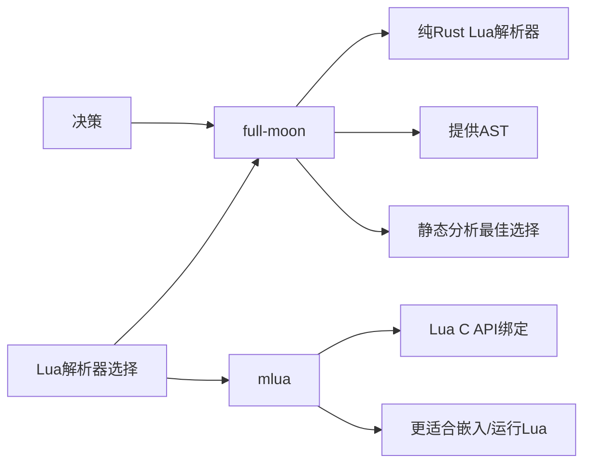
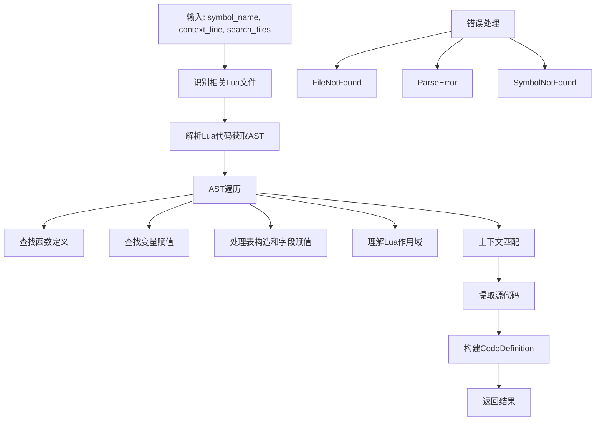
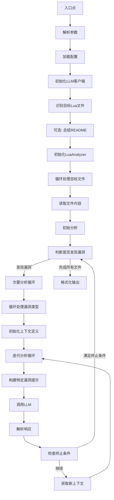
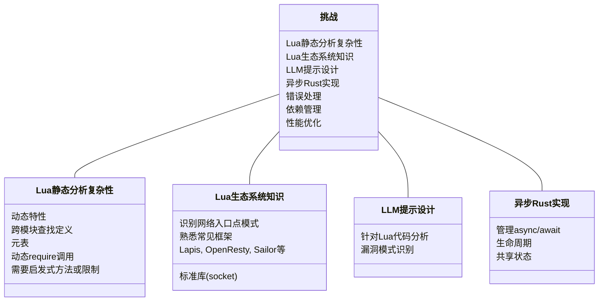

# LuaShield

## 项目概述

本文档详细描述了使用 Rust 语言开发的 Lua 代码安全漏洞分析工具的全面方案。

### 项目目标

开发 LuaShield 工具，使用 Rust 语言实现，以分析 Lua 代码库中的安全漏洞（LFI、RCE、SSRF、AFO、SQLi、XSS、IDOR 等），
并利用大语言模型（LLM）进行分析指导和上下文收集。

## 核心原则



1. **工作流设计**：构建高效分析流程 (README 摘要 -> 初始文件分析 -> 迭代上下文收集 -> 特定漏洞分析 -> 结果报告)。

2. **利用 Rust 优势**：充分发挥 Rust 的性能、安全性和强类型特性。为 I/O 密集型任务（LLM 调用、文件操作）使用异步编程（async/await）。

3. **模块化设计**：使用清晰的模块划分不同职责（LLM 交互、Lua 分析、文件系统操作、提示生成、配置管理）。

4. **健壮错误处理**：使用 Rust 的 Result 类型实现全面的错误处理，并考虑使用 thiserror 和 anyhow 等 crate。

5. **分析目标聚焦**：专注于 Lua 语言的代码解析和安全漏洞模式识别。

## 实现阶段

### 阶段 1: 项目设置和基础 Crate 选择

#### 初始化 Rust 项目

```bash
cargo new luashield --lib  # 或 --bin，但库结构通常更整洁
```

- 在 Cargo.toml 中设置初始元数据

#### 核心依赖选择



- **异步运行时**：tokio（事实标准），启用 fs、macros、rt-multi-thread 功能
- **HTTP 客户端**：reqwest（基于 tokio，功能丰富），启用 json 功能
- **序列化/反序列化**：serde、serde_json（处理 LLM API 请求/响应和内部数据结构）
- **错误处理**：thiserror（定义自定义库错误类型）、anyhow（简化二进制/主逻辑中的错误处理）
- **日志记录**：tracing、tracing-subscriber（结构化、异步感知日志），考虑使用 tracing-appender 进行文件日志记录
- **参数解析**：clap（强大的 CLI 参数解析器），启用 derive 功能
- **配置管理**：dotenvy（加载 .env 文件以获取 API 密钥等）
- **正则表达式**：regex（用于文件中的模式匹配）
- **文件系统工具**：walkdir 或 glob（递归查找文件，补充 tokio::fs）

#### 基本项目结构

```
src/
├── main.rs      # 入口点，CLI解析，日志设置，顶层编排
├── lib.rs       # 主库文件，模块声明
├── error.rs     # 使用thiserror定义自定义错误类型
├── config.rs    # 加载/管理配置的结构和函数(API密钥、URL、模型名称)
└── models.rs    # 定义核心数据结构(AnalysisReport, ContextCode, VulnType等)
```

### 阶段 2: 实现核心工具

#### 配置加载 (config.rs)

- 定义 `Config` 结构体，保存 API 密钥、基础 URL、模型名称
- 实现 `load_config()` 函数，使用 dotenvy 从 .env 和环境变量读取配置

#### 日志设置 (main.rs)

- 初始化 tracing 和 tracing-subscriber
- 配置格式（如 JSON）和输出（控制台、通过 tracing-appender 输出到文件）

#### CLI 解析 (main.rs)

- 使用 clap::Parser derive 宏定义 CLI 参数，镜像 Python argparse 设置（--root、--analyze、--llm、--verbosity）

#### 文件系统操作 (fs_utils.rs)

替换 RepoOps:

- **find_lua_files**：使用 walkdir 或 glob 查找所有 .lua 文件，应用排除逻辑（路径如 /test、/spec、/vendor，文件名如 _spec.lua）
- **read_file_content**：使用 tokio::fs::read_to_string 的异步函数
- **get_readme_content**：查找并读取 README.md 或类似文件的逻辑
- **find_network_related_files**：关键更改：定义 Lua 特定正则表达式模式，识别潜在网络入口点（例如，搜索常见的 Lua Web 框架，如 Lapis、OpenResty ngx.req、socket 库等）

#### LLM 客户端抽象 (llm/mod.rs, llm/client.rs, llm/*.rs)



- 定义具有 chat 方法的异步 LlmClient trait：

```rust
#[async_trait::async_trait]
pub trait LlmClient {
    async fn chat(&self, messages: Vec<ChatMessage>, response_model_schema: Option<&str>) -> Result<String, LlmError>;
    // 如果客户端内需要历史管理，可能添加其他方法
}
```

- 使用 serde 定义共享结构体，如 `ChatMessage { role: String, content: String }`
- 为 ClaudeClient、OpenAIClient、OllamaClient 实现该 trait
- 使用 reqwest::Client 发送 HTTP 请求
- 使用 serde_json 构造特定 API 的请求体。处理特定功能，如 OpenAI 的 JSON 模式
- 使用 serde_json 解析响应
- 将 HTTP/API 错误映射到自定义 LlmError 变体（例如，RateLimit、ApiError、ConnectionError）
- 处理 API 密钥认证
- 在 main.rs 或 llm/mod.rs 中添加工厂函数，根据 CLI 参数创建适当的客户端

### 阶段 3: Rust 中的提示工程

#### 提示结构体 (prompt/mod.rs, models.rs)

- 定义 Rust 结构体用于提示模板（例如，`FileCode { file_path: String, file_source: String }`、`Instructions { instructions: String }`、`CodeDefinitions { definitions: Vec<CodeDefinition> }` 等）。使用 serde::Serialize
- 定义主要 Response 模型，使用 serde::{Serialize, Deserialize}

#### 提示模板

- 将核心提示文本存储在单独的文件中（例如，prompts/initial_analysis.txt、prompts/lfi_analysis.txt）或使用 include_str! 嵌入
- 决策：使用 JSON 结构化提示。这与 serde 更好地集成。LLM 交互将涉及发送结构化 JSON 对象或包含 JSON 片段的字符串

#### 提示构建 (prompt/builder.rs)

- 创建函数来构建不同的提示（初始、次要、README 摘要）
- 这些函数将接收相关数据（文件内容、上下文代码定义、漏洞类型等），填充上面定义的提示结构体，并使用 serde_json::to_string 或 serde_json::to_value 将部分或整个提示序列化为 JSON 字符串
- 发送给 LLM 的最终提示可能是指令文本和代表结构化数据（代码、模式、先前分析）的 JSON 块的混合

### 阶段 4: Lua 代码分析引擎

#### 选择 Lua 解析器



- **full-moon**：纯 Rust Lua 解析器。提供 AST（抽象语法树）。这是 Rust 内静态分析的最有希望的方法
- **mlua**：Lua C API 的绑定。对静态分析不太直接，更适合嵌入/运行 Lua
- **决策**：使用 full-moon

#### 实现 LuaAnalyzer (analysis/mod.rs, analysis/lua_analyzer.rs)

- **结构**：LuaAnalyzer 结构体，持有仓库根路径
- **核心方法**：
  ```rust
  async fn extract_symbol(
      &self, 
      symbol_name: &str, 
      context_line: &str, 
      search_files: &[PathBuf]
  ) -> Result<Option<CodeDefinition>, AnalysisError>
  ```

- **逻辑**：



1. **识别相关 Lua 文件**：使用 context_line 缩小文件搜索范围（类似于 Python 版本的文件搜索）。读取文件内容（tokio::fs）
2. **解析 Lua 代码**：使用 full_moon::parse(&file_content) 获取每个相关文件的 AST
3. **AST 遍历**：这是复杂部分。实现逻辑以遍历 full_moon AST（full_moon::ast::Stmt、full_moon::ast::Expr 等）
   - 查找函数定义（FunctionDeclaration、LocalFunction）
   - 查找变量赋值（Assign、LocalAssign）。查找匹配 symbol_name 的赋值。处理表构造函数和字段赋值（TableName.FieldName = ... 或 TableName['FieldName'] = ...）
4. **作用域处理**：搜索时理解 Lua 的作用域规则（local vs. global）
5. **上下文匹配**：使用 context_line 和 AST 节点位置信息（通过 full_moon::node::NodeInfo 获取）精确定位引用，然后找到其定义
6. **提取源代码**：一旦找到定义的 AST 节点，使用其位置信息（start_token、end_token）从原始文件内容中提取相应的源代码片段
7. **处理边缘情况**：模块导入（require）、元表、复杂表结构。这将需要迭代和测试
8. **辅助结构体**：`CodeDefinition { name: String, context_name_requested: String, file_path: String, source: String }`（类似于 Python）
9. **错误处理**：定义 AnalysisError 变体（例如，FileNotFound、ParseError、SymbolNotFound）

### 阶段 5: 编排和工作流程

#### 主分析循环 (main.rs 或 orchestration.rs)



实现分析工作流程：

1. **解析参数**（clap）
2. **加载配置**（config::load_config）
3. **初始化 LLM 客户端**
4. **识别目标 Lua 文件**（fs_utils::find_lua_files 或基于 --analyze 参数）
5. **（可选）总结 README**：
   - 读取 README（fs_utils::get_readme_content）
   - 构建 README 摘要提示（prompt::builder）
   - 调用 LLM（llm_client.chat）
   - 解析摘要（简单字符串提取或预期 JSON）
   - 更新系统提示内容
6. **初始化 LuaAnalyzer**
7. **循环处理目标文件**：
   - 读取文件内容
   - **初始分析**：
     - 构建初始分析提示（包括代码、指令、响应模式 JSON）
     - 调用 llm_client.chat
     - 将响应反序列化为 AnalysisReport 结构体（serde_json::from_str）。处理反序列化错误
     - 记录/打印初始报告
   - **次要分析循环**（如果发现漏洞）：
     - 循环处理报告中的漏洞类型
     - 初始化 context_definitions: HashMap<String, CodeDefinition>
     - 固定迭代次数循环（例如，7 次）：
       - 构建特定漏洞提示（包括文件代码、当前 context_definitions、特定漏洞指令、先前分析、模式）
       - 调用 llm_client.chat
       - 将响应反序列化为 AnalysisReport
       - 记录/打印报告
       - 检查终止条件（没有请求新上下文、满足置信度阈值、达到最大迭代次数）
     - **获取新上下文**：
       - 遍历新报告中的 context_code 请求
       - 对于 context_definitions 中不存在的每个请求：
         - 调用 lua_analyzer.extract_symbol
         - 如果成功，将 CodeDefinition 添加到 context_definitions
       - 如果在一次迭代中没有添加新定义，则中断（或满足其他条件）
8. **输出格式化**（output.rs 或 main.rs 中）：
   - 实现 print_report(report: &AnalysisReport) 函数，以可读格式打印分析结果

### 阶段 6: 测试、完善和打包

#### 单元测试 (#[cfg(test)] 模块)

- 测试特定代码片段的 Lua AST 解析
- 测试各种 Lua 结构的 extract_symbol 逻辑
- 测试提示生成函数
- 测试配置加载
- 测试文件过滤逻辑

#### 集成测试

- 创建示例 Lua 项目
- 模拟 LLM API 响应（例如，使用 wiremock-rs 或自定义逻辑）
- 测试端到端分析工作流程

#### CI/CD (GitHub Actions)

- cargo fmt --check（格式化）
- cargo clippy -- -D warnings（代码静态分析）
- cargo test（单元和集成测试）
- cargo build --release（发布构建）
- （可选）创建带二进制文件的发布版本

#### 容器化 (Dockerfile)

- 使用官方 Rust 基础镜像（例如，rust:1.xx-slim-bookworm）
- 实现多阶段构建，以获得更小的最终镜像
- 复制源代码，使用 cargo build --release 构建
- 将 ENTRYPOINT 设置为编译后的二进制文件
- 更新 .dockerignore

#### 文档

- 为 Rust 版本、新的 Lua 焦点、构建说明、使用方法和配置广泛更新 README.md
- 为公共函数和结构体添加 Rustdoc 注释（///）
- 解释所搜索的 Lua 网络模式

## 关键挑战和考虑因素



1. **Lua 静态分析复杂性**：Lua 高度动态。静态分析（特别是跨模块、元表和动态 require 调用可靠地查找定义）具有技术挑战。使用 full-moon 的 LuaAnalyzer 将是最具挑战性的部分，可能需要大量努力和潜在的启发式方法或限制。

2. **Lua 生态系统知识**：识别相关网络入口点模式需要熟悉常见的 Lua Web 框架（Lapis、OpenResty、Sailor 等）和标准库（socket）。

3. **LLM 提示设计**：构建针对 Lua 语言特性的有效提示，引导 LLM 准确识别各种安全漏洞模式。

4. **异步 Rust 实现**：需要仔细管理 async/await、生命周期和任何共享状态。

5. **错误处理**：设计良好的错误层次结构对调试很重要。

6. **依赖管理**：优化 Cargo 依赖，正确理解各 crate 特性与功能。

7. **性能优化**：确保高效的 AST 遍历和文件 I/O，必要时进行性能分析和优化。

此计划提供了 LuaShield 项目的全面路线图。Lua 分析引擎（阶段 4）代表了最大的技术挑战。迭代和完善，特别是围绕 Lua 解析器交互和 AST 遍历逻辑，将是至关重要的。